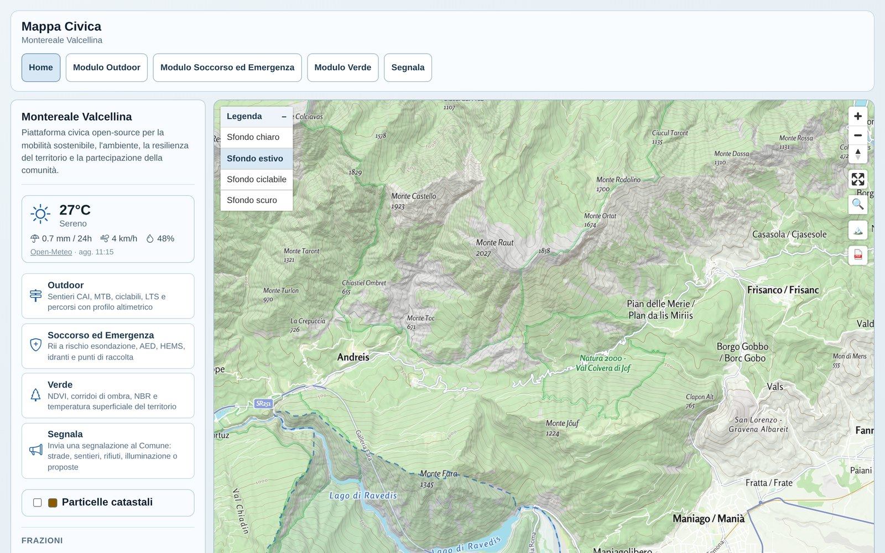

# Mappa Civica

[](https://github.com/leoventuroso/mappa-civica/actions/workflows/deploy.yml)
[](LICENSE)

An open-source, serverless civic tech platform for sustainable mobility, environmental monitoring, emergency resilience, and community reporting. Deployed at zero hosting cost as a static site, currently live for the comune of Montereale Valcellina (Friuli-Venezia Giulia, Italy) and built to be reused for any other comune: see [Reusing this for another comune](#reusing-this-for-another-comune).

**Live:** https://leoventuroso.github.io/mappa-civica/montereale-valcellina/



---

## Quick start

Prerequisites: Node 20+, Python 3.11+ (only needed for the data pipeline).

```bash
git clone https://github.com/leoventuroso/mappa-civica.git
cd mappa-civica/frontend
npm install
npm run dev
```

Opens at `http://localhost:5173`. All map data ships pre-built in `frontend/public/data/`, so the frontend runs standalone, no pipeline execution required.

To also run the data pipeline (regenerate GeoJSON from OSM/Sentinel/Landsat):

```bash
cd pipeline
python -m venv .venv && source .venv/bin/activate
pip install -r requirements.txt
make help
```

Other frontend commands: `npm run build` (production build, `tsc -b && vite build`), `npm run preview` (serve the build locally).

---

## Project structure

```
/frontend       React + TypeScript + MapLibre GL app (Vite)
/pipeline       Python GIS pipeline (OSM, Sentinel-2, Landsat -> static GeoJSON)
/functions      GitHub Actions build/refresh automation
/docs           Extended documentation
```

---

## Modules

- **Home**: municipal overview map, key indicators (demographics, services, risk), frazioni list
- **Outdoor**: cycling (traffic-stress map, bike infrastructure, route planner) and hiking (trails, slope, shade corridors)
- **Soccorso ed Emergenza**: flood-prone streams census (Censimento RII), forest fire perimeters (IRDAT FVG), and emergency assets (defibrillators, hydrants, HEMS, assembly points)
- **Green**: satellite-derived vegetation health, natural shade, and surface temperature
- **Segnala**: citizen reporting, place a pin, describe the issue, submit via a pre-filled email to the municipality

Full feature breakdown, data sources per layer, and shared map controls: [docs/MODULES.md](docs/MODULES.md).

---

## Architecture

100% Jamstack, no backend server:

- **Frontend**: React + TypeScript + MapLibre GL 6, hash-based routing, mobile-first responsive layout
- **Live basemap**: hosted vector styles from Maptoolkit (light/summer/cycling/dark), same service the integrated stressinbici.it map uses
- **Static data layer**: GeoJSON/PMTiles produced offline by the Python pipeline, served as static assets
- **Community reports**: DuckDB-Wasm in the browser for read access; new reports stored in `localStorage` and sent via `mailto:`, no server round-trip
- **CI/CD**: GitHub Actions builds and deploys to GitHub Pages on every push to `main`, plus a scheduled job that refreshes GIS data (see [Deployment](#deployment--data-refresh))

---

## Reusing this for another comune

Everything comune-specific (name, OSM area, ISTAT code, municipal boundary, frazioni, map view) lives in one config file and a handful of data files, not scattered across the codebase. See [SETUP.md](SETUP.md) for the full checklist of what to configure and which raw data (satellite imagery, DEM) you'd need to source yourself.

---

## Deployment & data refresh

Static build published on GitHub Pages.

- `.github/workflows/deploy.yml`: builds and deploys on every push to `main`, also triggerable manually
- `.github/workflows/refresh-data.yml`: scheduled pipeline runs, committed back to the repo: weekly (`make rescue cyclepaths`), monthly (`make base community`), or manual for any target

---

## Data sources

| Layer | Source | Resolution | License |
|-------|--------|------------|---------|
| Road network, trails, POIs, services, peaks | OpenStreetMap / Nominatim | n/a | ODbL |
| Demographic and statistical data | ISTAT, esploradati.istat.it SDMX REST | n/a | CC BY |
| NDVI, NBR | Sentinel-2 L2A (ESA/Copernicus) | 10-20 m | Free/Open |
| LST | Landsat 8/9 Collection 2 L2 (USGS) | 30 m | Public Domain |
| Flood-prone streams (Censimento RII) | Gruppo Comunale di Protezione Civile, volunteer field survey (2013, 2024) | point | Provided by the comune |
| Forest fire perimeters | Regione FVG, IRDAT dataset 1232 (Fogli Notizie Incendi Boschivi), WFS | polygon | Regional open data |
| Elevation / slope | DEM/LiDAR | n/a | Open Data |
| Live basemap tiles/styles | Maptoolkit (`styles.maptoolkit.org`) | n/a | See provider terms |
| LTS (traffic stress) map | stressinbici.it / [LTSBikePlan](https://github.com/dclfbk/LTSBikePlan) (live iframe embed) | n/a | See project's own license |
| 3D terrain DEM | Mapterhorn terrarium-encoded DEM | n/a | Free/Open |
| UI icons | Bootstrap Icons | n/a | MIT |

---

## License

[MIT](LICENSE)

---

## Contributing

Contributions to data layers, frontend features, or processing pipelines are welcome.

- To report bugs or suggest features: open an Issue
- To submit code or data updates: open a Pull Request targeting the relevant module directory
